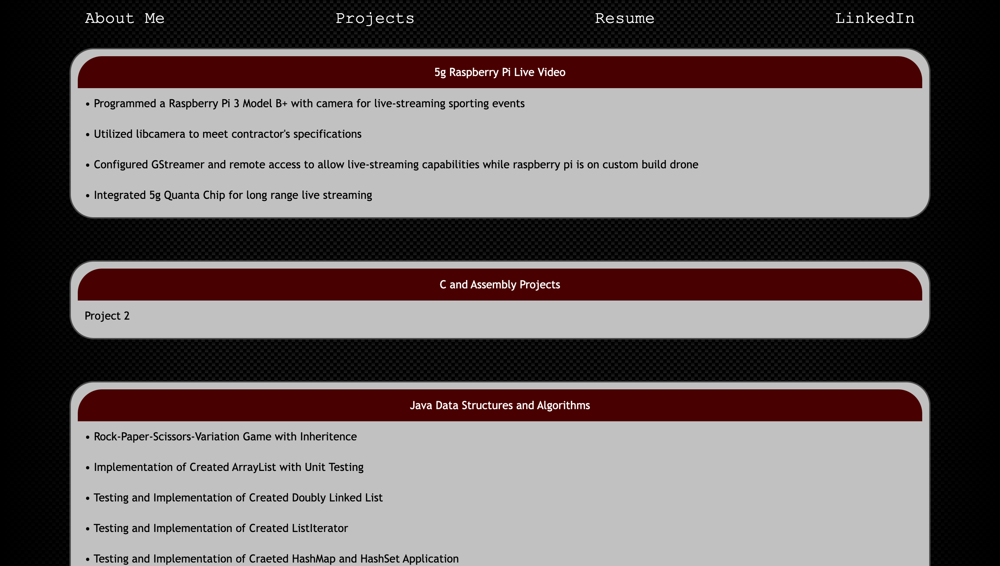
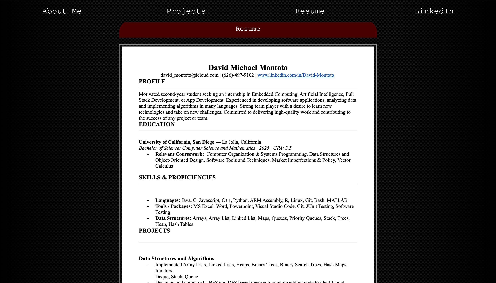

# David Montoto's personal website
### Created and Designed by David Montoto

[Portfolio Website](https://dmmontoto.github.io/Portfolio-Website/)

My main focus for my Portfolio Website was to summarize the various projects I have done in Java, C, Assembly, Javascript, and more. I tried to achieve this goal, while portraying a modern and simple look. By comprising projects based on languages used and similarities, I was able to organize the projects section in an eloquent manner. 

The inspiration behind the page's design is a combination of modern and automotive elements. The carbon fiber look, alongside the racer red are excellent elements to symbolize performance, experience, and a drive for success. Similarly, those descriptive elements can be used to summarize my software-engineering journey and projects. The images below show the elements discussed above. 

My software-enginnering journey has only begun; moreover, this website will be improved, tweaked, and reorganized as more projects are developed and created. As an incoming junior at The University of California, San Diego, I expect to diversify my projects with time.

